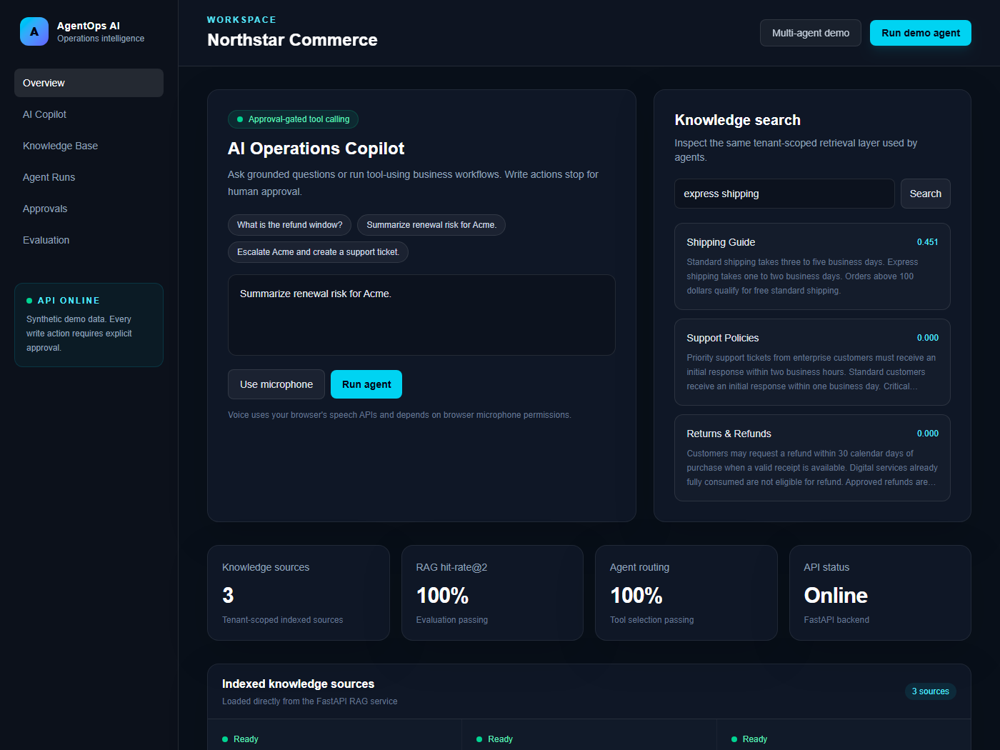
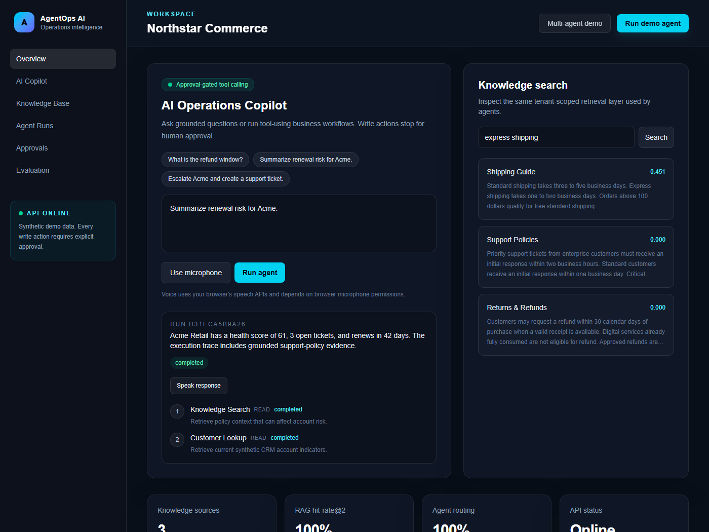
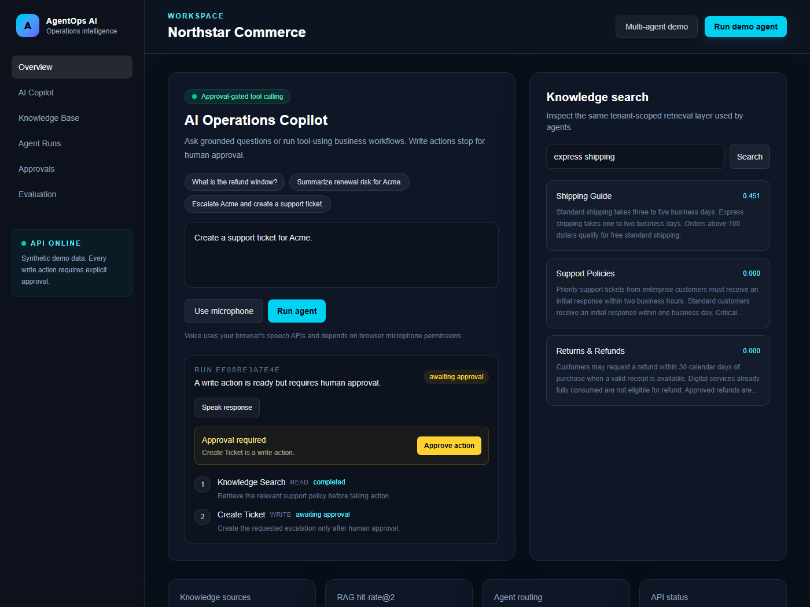
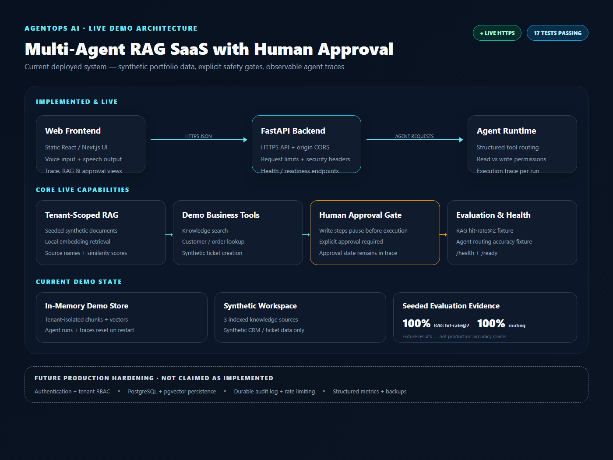

# AgentOps AI

**Multi-Agent RAG SaaS for Business Operations**

AgentOps AI is a production-style full-stack AI portfolio project designed to demonstrate the capabilities repeatedly requested in current Upwork AI SaaS roles: modern web development, RAG, AI agents, tool calling, vector search, multi-tenant architecture, APIs, evaluation, observability, and cloud deployment.

## Product concept

A business workspace where a team can:
- upload company documents and build a cited knowledge base
- chat with an AI copilot grounded in company data
- run tool-using AI agents for business operations
- review plans, tool calls, results, and confidence
- require human approval before sensitive actions
- inspect retrieval quality, latency, and agent traces
- use browser voice input/output
- manage multiple workspaces with tenant-aware isolation

## Planned stack

Frontend:
- Next.js, React, TypeScript, Tailwind CSS
- streaming chat UI
- dashboard and execution trace views

Backend:
- Python, FastAPI, Pydantic
- SSE streaming
- background job abstraction

AI:
- provider-neutral LLM adapter
- RAG with citations
- embeddings plus pgvector
- state-graph agent orchestration
- structured tool calling
- MCP-style tool registry
- retrieval and agent evaluation
- approval safeguards for actions

Current demo data/platform:
- seeded synthetic business data
- tenant-scoped in-memory RAG/vector store
- workspace isolation tests
- in-memory agent execution traces
- no real client data or external write integrations

Production target:
- authentication and tenant-aware RBAC
- PostgreSQL + pgvector persistence
- durable audit/event log
- optional Redis-compatible cache/queue

Delivery:
- Dockerfiles and Docker Compose for local/container deployment
- GitHub Actions CI definition
- Render Blueprint for a free static Next.js demo + FastAPI service
- environment templates and deployment smoke-test checklist

## Current demo architecture

Browser / Next.js static frontend
 -> HTTPS API calls with frontend-origin CORS allowlisting
 -> FastAPI
    -> demo workspace isolation
    -> RAG pipeline + in-memory vector store
    -> agent runtime + structured tools
    -> human approval gates
    -> evaluation / execution traces

Production persistence/authentication are deliberately documented as the next hardening layer rather than claimed as already implemented.

## Portfolio outcome

Completed:
- [x] public GitHub repository
- [x] live deployed web app
- [x] seeded demo workspace with synthetic data
- [x] architecture documentation
- [x] automated tests and CI definition
- [x] polished live-product screenshots
- [x] recruiter-friendly architecture visual
- [x] 50-second walkthrough video
- [x] natural-tone narration/audio
- [x] Upwork portfolio item published

## Live product evidence

| Multi-agent execution trace | Human approval gate |
| --- | --- |
|  |  |

Additional approved-action evidence is available in `portfolio/screenshots/04-live-approved-action.png`.

Portfolio copy, the recruiter-facing architecture visual, narration script, and the finished 50-second walkthrough video are stored in the `portfolio/` directory.

[Watch the 50-second AgentOps AI walkthrough](portfolio/agentops-ai-portfolio-demo.mp4)

## Current status

**Step 9 — portfolio packaging and Upwork publishing complete; deployment remains live and smoke-tested.**

Live demo:
- Frontend: https://agentops-ai-demo-tirthanand17.onrender.com
- API: https://agentops-ai-api-tirthanand17.onrender.com
- API docs: https://agentops-ai-api-tirthanand17.onrender.com/docs

Deployment:
- free Render Static Site for the Next.js frontend
- free Render Python web service in Singapore for FastAPI
- frontend build uses the deployed API HTTPS URL
- backend CORS is restricted to the deployed frontend origin
- public demo remains synthetic/stateless; no unused database is provisioned just for a technology claim
- Git history and tracked-file scans found no obvious API-token/private-key patterns

Validated:
- FastAPI test suite: 17 passed
- focused frontend ESLint: passed
- Next.js standalone production build: passed
- Next.js Render/static-export build: passed
- production npm audit: 0 vulnerabilities
- frontend and API live over HTTPS
- `/health` and `/ready`: HTTP 200
- grounded knowledge search: passed
- renewal-risk agent trace: `knowledge_search -> customer_lookup`
- approval-gated write workflow: correctly paused, then completed after approval
- RAG evaluation hit-rate@2: 100% on the seeded fixture
- agent routing accuracy: 100% on the seeded fixture

Current: Step 9 complete — screenshots, portfolio copy, architecture visual, walkthrough video, narration, and Upwork portfolio publishing are finished.
